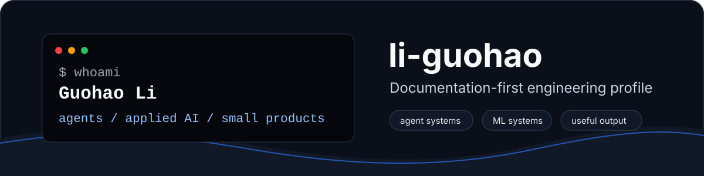

<p align="center">
  
</p>

<p align="center">
  <a href="https://github.com/li-guohao">
    
  </a>
  <a href="https://li-guohao.github.io">
    
  </a>
  
</p>

```txt
> building applied AI systems, developer tools, and small products that leave useful traces
```

## Now

- Shipping practical AI and automation projects across agents, monitoring, and developer workflows.
- Exploring efficient ML systems, attention mechanisms, and local model constraints.
- Keeping public work readable enough to inspect, reuse, and improve later.

## Selected Work

| Project | What it is | Stack / lane | Signal |
| --- | --- | --- | --- |
| [`worldmonitor`](https://github.com/li-guohao/worldmonitor) | Real-time global intelligence dashboard for news, geopolitical, and infrastructure monitoring | TypeScript, applied AI | Current product work |
| [`engineering-intelligence-suite`](https://github.com/li-guohao/engineering-intelligence-suite) | Technical debt, PERT cost estimation, and incident management toolkit with LLM support | TypeScript, developer tools | Zero-runtime-dependency toolkit |
| [`asam-attention`](https://github.com/li-guohao/asam-attention) | Adaptive Sparse Attention Module with Flash Attention optimization | Python, PyTorch, CUDA | Efficient ML systems |
| [`agentguard`](https://github.com/li-guohao/agentguard) | Security guard for AI agents, skill trust, secret protection, and runtime action checks | Agent security | Safety infrastructure |
| [`OpenRobotHarness`](https://github.com/li-guohao/OpenRobotHarness) | Landing repo for robot harness model, dataset, and benchmark work | Robotics, benchmark design | Research scaffold |
| [`workplace-cookware-trio`](https://github.com/li-guohao/workplace-cookware-trio) | A set of workplace responsibility and negotiation AI skills | AI skills | Bilingual skill package |

## Operating Notes

| Principle | What it means in practice |
| --- | --- |
| Clear interfaces | Prefer explicit workflows, readable docs, and small public surfaces. |
| Practical experiments | Treat prototypes as learning loops, but leave enough structure for reuse. |
| Agent-aware engineering | Design tools around prompts, permissions, traces, and failure modes. |
| Measured claims | Let repositories and benchmarks carry the proof instead of oversized profile widgets. |

## Stack Signals

```txt
primary lanes    TypeScript / Python / Markdown / GitHub workflows
applied AI       agent skills / monitoring / prompt tooling / automation
systems work     attention mechanisms / GPU-aware optimization / benchmarks
product surface  small web apps / dashboards / documentation-first tools
```

## Contact

- GitHub: [`@li-guohao`](https://github.com/li-guohao)
- Blog: [`li-guohao.github.io`](https://li-guohao.github.io)
- Email: [`guohaoli2000@gmail.com`](mailto:guohaoli2000@gmail.com)
- LinkedIn: [`guohao-li`](https://www.linkedin.com/in/guohao-li)

<details>
<summary>Profile design note</summary>

This profile is intentionally compact: one static banner, a few consistent badges, selected work with context, and no trophy wall or stats collage. The structure is designed to make future public projects easy to add without changing the visual system.

</details>
